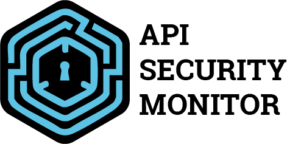

# API Security Monitor


A robust middleware for monitoring and protecting Express.js APIs against common attacks, it can use logs in local storage or save them to Redis and MongoDB. This package provides real-time detection of DDoS attacks, scanning suspicious activities, and automatic IP blocking.

Complement your development testing with our Chrome Extension: [API Security Monitor Dashboard](https://chromewebstore.google.com/detail/api-security-monitor-dash/bljgdebpoimjemfdnjmpjmjagbihpjfd) (only in Advanced Usage with Redis and MongoDB logs)

## Features

- 🛡️ Rate limiting by IP address
- 🔍 Detection of path scanning attempts
- 🚫 Automatic IP blocking for suspicious activity
- ⚙️ Highly configurable thresholds and time windows
- ⚡ Redis-based request tracking for high performance
- 📝 MongoDB logging support for attack analysis
- 🔌 Easy integration with Express.js applications

## Installation

```bash
npm install api-security-monitor
```

## Quick Start, Basic Usage only with local storage logs

```javascript
const express = require('express');
const APIMonitor = require('api-security-monitor');

const app = express();

// Basic configuration
const basicConfig = {
  maxRequests: 5,      // Maximum 5 requests
  timeWindow: 5,       // In a 5-second window
  scanThreshold: 3,    // Maximum 3 unique routes
  saveRecords: false   // Local storage
};

// Create monitor instance
const { middleware, monitor } = APIMonitor(basicConfig);

// Use the same monitor for IP blocking
app.use((req, res, next) => monitor.blockIPsMiddleware(req, res, next));

// Then apply the monitoring middleware
app.use(middleware);

// Example routes
app.get('/', (req, res) => {
  res.json({ message: 'API working correctly' });
});

// Listen for attack events
monitor.on('attack-detected', (data) => {
  console.log('🚨 Attack detected:', {
    ip: data.ip,
    type: data.type,
    time: new Date(data.timestamp)
  });
});
```

## Advanced Usage with Redis and MongoDB logs

```javascript
const express = require('express');
const APIMonitor = require('api-security-monitor');

const app = express();

// Advanced configuration
const monitorConfig = {
  maxRequests: 1000,      // Maximum 5 requests
  timeWindow: 3600,       // In a 5-second window
  scanThreshold: 20,    // Maximum 3 unique routes
  saveRecords: true,   // Use Redis and MongoDB
  mongoURI: process.env.MONGO_URI, // MongoDB URI
  redisURL: process.env.REDIS_URL, // Redis URI
};

// Create monitor instance
const { middleware, monitor } = APIMonitor(monitorConfig);

// Use the same monitor for IP blocking
app.use((req, res, next) => monitor.blockIPsMiddleware(req, res, next));

// Then apply the monitoring middleware
app.use(middleware);

// Example routes
app.get('/', (req, res) => {
  res.json({ message: 'API working correctly' });
});

// Query logs with filters
app.get('/logs', async (req, res) => {
  try {
    const { ip, attackType, startDate, endDate, limit = 10 } = req.query;
    const query = {};

    if (ip) query.ip = ip;
    if (attackType) query.attackType = attackType;
    if (startDate || endDate) {
      query.timestamp = {};
      if (startDate) query.timestamp.$gte = new Date(startDate);
      if (endDate) query.timestamp.$lte = new Date(endDate);
    }

    const logs = await monitor.LogModel.find(query)
      .sort({ timestamp: -1 })
      .limit(parseInt(limit));

    res.json(logs);
  } catch (error) {
    res.status(500).json({ error: 'Error fetching logs' });
  }
});

// Get attack statistics
app.get('/logs/stats', async (req, res) => {
  try {
    const stats = await monitor.LogModel.aggregate([
      {
        $group: {
          _id: '$ip',
          totalRequests: { $sum: 1 },
          avgResponseTime: { $avg: '$responseTime' },
          attackCount: {
            $sum: { $cond: [{ $ne: ['$attackType', null] }, 1, 0] }
          },
          routes: { $addToSet: '$route' }
        }
      },
      { $sort: { totalRequests: -1 } }
    ]);
    res.json(stats);
  } catch (error) {
    res.status(500).json({ error: 'Error fetching stats' });
  }
});

// Query attack logs route
app.get('/logs/attacks', async (req, res) => {
  try {
    const attackLogs = await monitor.LogModel.find({ 
      attackType: { $ne: null } 
    }).sort({ timestamp: -1 });
    res.json(attackLogs);
  } catch (error) {
    res.status(500).json({ error: 'Error fetching attack logs' });
  }
});
```

## Configuration Options

| Option | Type | Default | Description |
|--------|------|---------|-------------|
| `maxRequests` | number | `10` | Maximum requests allowed per time window |
| `timeWindow` | number | `60` | Time window in seconds |
| `scanThreshold` | number | `5` | Maximum unique endpoints allowed per time window |
| `saveRecords` | boolean | `false` | Save logs to MongoDB, only local storage |
| `mongoURI` | string | `process.env.MONGO_URI` | MongoDB connection URI |
| `redisURL` | string | `process.env.REDIS_URL` | Redis connection URL |

## Environment Variables

Create a `.env` file in your project root:

```env
MONGO_URI=mongodb://localhost:27017/api-monitor
REDIS_URL=redis://localhost:6379
```

## Advanced Usage

### Custom Rate Limiting

```javascript
const monitor = APIMonitor({
  maxRequests: 1000,      // Maximum 5 requests
  timeWindow: 3600,       // In a 5-second window
  scanThreshold: 20,    // Maximum 3 unique routes
  saveRecords: true,   // Use Redis and MongoDB
  mongoURI: process.env.MONGO_URI, // MongoDB URI
  redisURL: process.env.REDIS_URL, // Redis URI
});
```

### Blocking Suspicious IPs

```javascript
// Add both monitoring and blocking middleware
app.use(APIMonitor());
app.use(APIMonitor.blockIPs());

// The blocked IPs will receive a 403 response
```

## Events

The middleware emits events that you can listen to:

```javascript
const monitor = APIMonitor();
monitor.on('attack-detected', (data) => {
  console.log(`Attack detected from IP: ${data.ip}`);
});
```

## Contributing

🚧 **Note:** We are not accepting contributions at this time as the project is in early development stage. Please check back later.

## License

This project is licensed under the MIT License - see the [LICENSE](LICENSE) file for details.

## Support

- 🐛 Issues: [GitHub Issues](https://github.com/javier-cuevas/api-security-monitor/issues)
- 📖 Documentation: [Wiki](https://github.com/javier-cuevas/api-security-monitor/wiki)

## Acknowledgments

- Express.js team
- MongoDB team
- Redis team
