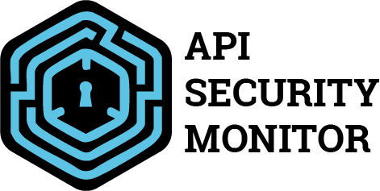

# API Security Monitor


Middleware for monitoring and protecting Express.js APIs against common attacks in real-time. Works out of the box with zero external dependencies (local mode), or scales to distributed environments using Redis and MongoDB.

Complement your development with our Chrome Extension: [API Security Monitor Dashboard](https://chromewebstore.google.com/detail/api-security-monitor-dash/bljgdebpoimjemfdnjmpjmjagbihpjfd) — available in Advanced mode (Redis + MongoDB).

---

## Features

- Rate limiting per IP address
- Path scanning detection
- Automatic IP blocking (5-minute TTL)
- Event emission for custom alerting
- Local-mode block persistence via NDJSON log (survives restarts)
- Periodic cleanup of expired in-memory data
- Redis-based distributed tracking (optional)
- MongoDB persistent logging (optional)
- Full TypeScript support
- Drop-in Express.js middleware

---

## Installation

```bash
npm install api-security-monitor
```

---

## Quick Start — Local Mode (no external dependencies)

```javascript
const express = require('express');
const APIMonitor = require('api-security-monitor');

const app = express();

// Trust one upstream proxy so Express resolves req.ip from X-Forwarded-For
// without allowing client-side IP spoofing.
// Adjust the value to match your infrastructure:
//   app.set('trust proxy', 1)            → one hop (nginx, ALB…)
//   app.set('trust proxy', '10.0.0.1')   → specific proxy IP
app.set('trust proxy', 1);

const { middleware, blockIPs, monitor } = APIMonitor({
  maxRequests:  10,    // max requests per IP per time window
  timeWindow:   60,    // time window in seconds
  scanThreshold: 5,    // max unique routes before path-scan block
});

// 1. Reject already-blocked IPs as early as possible
app.use(blockIPs);

// 2. Track requests and detect new attacks
app.use(middleware);

app.get('/', (req, res) => {
  res.json({ message: 'API working correctly' });
});

app.listen(3000);
```

> **Note:** `blockIPs` and `middleware` share the same internal instance.
> A block set by `middleware` is immediately visible to `blockIPs`.

---

## Listening to Attack Events

```javascript
monitor.on('attack-detected', ({ ip, type, timestamp }) => {
  console.warn(`Attack from ${ip} — ${type} at ${timestamp}`);
  // forward to Slack, PagerDuty, your logging service, etc.
});
```

**Event payload:**

| Field | Type | Description |
|-------|------|-------------|
| `ip` | `string` | Client IP address |
| `type` | `string` | `"DDoS (Excessive Requests)"` or `"Path Scanning"` |
| `timestamp` | `Date` | When the attack was detected |

---

## Local Mode — Block Persistence

By default, blocked IPs live only in process memory and are lost on restart.
Enable lightweight persistence with `blockLogPath` — no Redis or MongoDB required.

```javascript
const { middleware, blockIPs, monitor } = APIMonitor({
  maxRequests:     100,
  timeWindow:      60,
  scanThreshold:   10,
  blockLogPath:    '/var/log/api-monitor/blocked.ndjson', // persist events here
  cleanupInterval: 60_000, // evict expired in-memory data every 60 s (default)
});
```

On startup the middleware reads the log file, restores any non-expired blocks into
memory, and resumes protecting the API as if the process never restarted.

### NDJSON format

Every block and unblock event is appended as a single JSON line
([NDJSON / JSON Lines](https://jsonlines.org/)):

```
{"timestamp":"2025-04-30T14:10:00.000Z","ip":"1.2.3.4","action":"block","reason":"DDoS (Excessive Requests)","route":"/api/users","expiresAt":1746020400000}
{"timestamp":"2025-04-30T14:15:00.000Z","ip":"1.2.3.4","action":"unblock","reason":"ttl_expired"}
```

| Field | Present on | Description |
|-------|-----------|-------------|
| `timestamp` | block + unblock | ISO-8601 event time |
| `ip` | block + unblock | Client IP address |
| `action` | block + unblock | `"block"` or `"unblock"` |
| `reason` | block + unblock | Attack type or `"ttl_expired"` |
| `route` | block only | Request path that triggered the block |
| `expiresAt` | block only | Unix-ms timestamp when the block expires |

### Compatibility with security tools

Because each event is one self-contained line, the log works natively with:

```bash
# Live stream of new events
tail -f /var/log/api-monitor/blocked.ndjson

# All events for a specific IP
grep '"1.2.3.4"' /var/log/api-monitor/blocked.ndjson

# Filter with jq
jq 'select(.action == "block")' /var/log/api-monitor/blocked.ndjson
jq 'select(.ip == "1.2.3.4")' /var/log/api-monitor/blocked.ndjson

# Count unique blocked IPs today
jq -r 'select(.action=="block") | .ip' blocked.ndjson | sort -u | wc -l
```

**fail2ban** — add a custom filter in `/etc/fail2ban/filter.d/api-monitor.conf`:

```ini
[Definition]
failregex = .*"ip":"<HOST>".*"action":"block".*
datepattern = "timestamp":"%%Y-%%m-%%dT%%H:%%M:%%S
```

**Filebeat / Logstash / ELK** — point the input at the file path; each line is parsed
as a JSON document automatically.

### Dashboard endpoints

All four dashboard endpoints use the same monitor methods in both local and advanced mode:

```javascript
app.get('/logs', async (req, res) => {
  try {
    const { ip, attackType, startDate, endDate } = req.query;
    const limit = Math.min(parseInt(req.query.limit) || 10, 100);

    if (startDate && isNaN(new Date(startDate))) return res.status(400).json({ error: 'Invalid startDate' });
    if (endDate   && isNaN(new Date(endDate)))   return res.status(400).json({ error: 'Invalid endDate' });

    res.json(await monitor.getLogs({ ip, attackType, startDate, endDate, limit }));
  } catch {
    res.status(500).json({ error: 'Error fetching logs' });
  }
});

app.get('/logs/attacks', async (req, res) => {
  try {
    const limit = Math.min(parseInt(req.query.limit) || 50, 100);
    res.json(await monitor.getAttackLogs({ limit }));
  } catch {
    res.status(500).json({ error: 'Error fetching attack logs' });
  }
});

app.get('/logs/stats', async (req, res) => {
  try {
    res.json(await monitor.getStats());
  } catch {
    res.status(500).json({ error: 'Error fetching stats' });
  }
});

app.get('/blocked', async (req, res) => {
  try {
    res.json(await monitor.getBlockedIPs());
  } catch {
    res.status(500).json({ error: 'Error fetching blocked IPs' });
  }
});
```

> In local mode (`saveRecords: false`) the methods read from `localBlockedIPs` and the NDJSON block log.
> In advanced mode (`saveRecords: true`) they query Redis and MongoDB.
> The response shape is identical in both modes.

---

## Advanced Mode — Redis + MongoDB

Enable persistent logs and distributed (multi-process) tracking by setting `saveRecords: true`.
This also unlocks the Chrome Extension dashboard.

```javascript
const express = require('express');
const APIMonitor = require('api-security-monitor');
const mongoSanitize = require('express-mongo-sanitize');
require('dotenv').config();

const app = express();

app.set('trust proxy', 1);
app.use(express.json());
// Strip MongoDB operators from all incoming data to prevent NoSQL injection
app.use(mongoSanitize());

const { middleware, blockIPs, monitor } = APIMonitor({
  maxRequests:   1000,
  timeWindow:    3600,
  scanThreshold: 20,
  saveRecords:   true,
  mongoURI:      process.env.MONGO_URI,
  redisURL:      process.env.REDIS_URL,
});

// 1. Reject already-blocked IPs as early as possible
app.use(blockIPs);

// 2. Track requests and detect new attacks
app.use(middleware);

// Mount dashboard endpoints (same methods as local mode)
app.get('/logs',         async (req, res) => { /* see Dashboard endpoints above */ });
app.get('/logs/attacks', async (req, res) => { /* see Dashboard endpoints above */ });
app.get('/logs/stats',   async (req, res) => { /* see Dashboard endpoints above */ });
app.get('/blocked',      async (req, res) => { /* see Dashboard endpoints above */ });

app.listen(3000);
```

**Environment variables** — create a `.env` file in your project root:

```env
MONGO_URI=mongodb://localhost:27017/api-monitor
REDIS_URL=redis://localhost:6379
```

---

## Configuration Options

| Option | Type | Default | Mode | Description |
|--------|------|---------|------|-------------|
| `maxRequests` | `number` | `10` | both | Max requests per IP per time window |
| `timeWindow` | `number` | `60` | both | Time window in seconds |
| `scanThreshold` | `number` | `5` | both | Max unique routes per IP before path-scan block |
| `saveRecords` | `boolean` | `false` | both | Enable Redis tracking + MongoDB logging |
| `mongoURI` | `string` | `process.env.MONGO_URI` | advanced | MongoDB URI — required when `saveRecords: true` |
| `redisURL` | `string` | `process.env.REDIS_URL` | advanced | Redis URL — required when `saveRecords: true` |
| `blockLogPath` | `string` | `null` | local | Path to NDJSON file for block persistence across restarts |
| `cleanupInterval` | `number` | `60000` | local | How often (ms) expired in-memory data is evicted |

---

## TypeScript

The package ships with full type definitions. No `@types/` package needed.

```typescript
import APIMonitor, { APIMonitorOptions, AttackEvent } from 'api-security-monitor';

const options: APIMonitorOptions = {
  maxRequests:  100,
  timeWindow:   60,
  blockLogPath: '/var/log/api-monitor/blocked.ndjson',
};

const { middleware, blockIPs, monitor } = APIMonitor(options);

monitor.on('attack-detected', (event: AttackEvent) => {
  console.warn(event.ip, event.type);
});
```

---

## API Endpoints — Dashboard

Both `basic-usage.js` (local mode) and `advanced-usage.js` (Redis + MongoDB) expose the same
four endpoints so the Chrome Extension Dashboard works with either mode without changes.

### `GET /logs`

Recent log entries. Supports query params: `ip`, `attackType`, `startDate`, `endDate`, `limit` (max 100).

```
GET /logs?ip=1.2.3.4&attackType=DDoS%20(Excessive%20Requests)&limit=20
```

Response — array:
```json
[
  {
    "ip": "1.2.3.4",
    "method": "GET",
    "route": "/api/users",
    "timestamp": "2025-04-30T14:10:00.000Z",
    "responseTime": 45,
    "statusCode": 200,
    "userAgent": "Mozilla/5.0...",
    "attackType": "DDoS (Excessive Requests)"
  }
]
```

### `GET /logs/attacks`

Same shape as `/logs`, filtered to entries where `attackType != null`. Supports `limit` (max 100).

```
GET /logs/attacks?limit=50
```

### `GET /logs/stats`

Per-IP attack statistics, sorted by `attackCount` descending.

Response — array:
```json
[
  {
    "_id": "1.2.3.4",
    "totalRequests": 312,
    "avgResponseTime": 48,
    "attackCount": 7,
    "routes": ["/api/users", "/admin", "/wp-login"]
  }
]
```

### `GET /blocked`

Currently blocked IPs with remaining TTL.

Response:
```json
{
  "count": 2,
  "blocked": [
    {
      "ip": "1.2.3.4",
      "reason": "DDoS (Excessive Requests)",
      "route": "/api/users",
      "remainingSec": 245,
      "blockedUntil": "2025-04-30T14:15:00.000Z"
    }
  ]
}
```

### Field availability by mode

| Field | Advanced (MongoDB) | Local (NDJSON) |
|-------|--------------------|----------------|
| `ip` | available | available |
| `timestamp` | available | available |
| `attackType` | available | available |
| `route` | available | available |
| `method` | available | `null` |
| `responseTime` | available | `null` |
| `statusCode` | available | `null` |
| `userAgent` | available | `null` |
| `totalRequests` (stats) | available | `null` |
| `avgResponseTime` (stats) | available | `null` |
| `routes` (stats) | available | `[]` |

> In local mode only block/unblock events are tracked (no per-request logging).
> `route` reflects the path of the request that triggered the block.
> The Chrome Extension renders `null` fields as `—`.

---

## `blockIPs` — shared vs standalone

The factory returns a `blockIPs` middleware that **shares state** with `middleware` and `monitor`:

```javascript
// Recommended — shared instance
const { middleware, blockIPs, monitor } = APIMonitor({ maxRequests: 100 });

app.use(blockIPs);   // same instance as middleware
app.use(middleware);
```

For independent guards (e.g. a separate admin app with its own rules), use the standalone factory:

```javascript
// Standalone — independent instance, separate blocked-IP list
const adminGuard = APIMonitor.blockIPs({ maxRequests: 10 });
adminApp.use(adminGuard);
```

> **Note:** `APIMonitor.blockIPs()` creates its own internal instance and does **not** share state
> with any factory instance. Use it intentionally for isolated scenarios.

---

## 403 Response

When a blocked IP makes a request, the middleware returns HTTP `403` with:

```json
{
  "error": "Access denied due to suspicious activity",
  "reason": "DDoS (Excessive Requests)",
  "blockedFor": "298 seconds",
  "blockedUntil": "2025-01-01T00:05:00.000Z"
}
```

---

## Support

- Issues: [GitHub Issues](https://github.com/javier-cuevas/api-security-monitor/issues)
- Documentation: [Wiki](https://github.com/javier-cuevas/api-security-monitor/wiki)

## License

MIT — see the [LICENSE](LICENSE) file for details.
